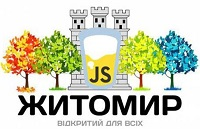

# React For Beginners - free course by Itera

## Progress 92%

✔️ ✔️ ✔️ ✔️ ✔️ ✔️ ✔️ ✔️ ✔️ ✔️ ⏳ ✔️ 

## About

**DISCLAIMER:**
All requests to "remove politics" will be removed completely without any comments. If you have another opinion - just skip this course.

This repo dedicated to the course "React for Beginners". The course was created to support Ukraine 🇺🇦 and Ukrainians in the war against russia. It's completely free and open-sourced. Feel free to contribute or make any relevant suggestions.

- Full program is [here](PROGRAM.md)
- Presentations can be found here - [https://drag13.io/react-learning-course-short/react-intro](https://drag13.io/react-learning-course-short/react-intro) where is the name of the lesson
- Changelog is [here](CHANGELOG.md)
- Video - pending. I will record the lessons and publish them afterwards
- Technical details are [here](devlog.md)

## PreRequisites

Basic knowledge with HTML/CSS/JS

Self check:

- Example of the block element, how to draw a button
- What is the width of block element, how to center element (vertically and horizontally)
- What does `.map` returns, how to sum all values in array

Basic knowledge with GIT:

Self Check:

- How to create new repository, how to push to remote

Existing account at [https://github.com](https://github.com)
Installed [Node.JS](https://nodejs.org/en/) with NPM
Installed [VsCode](https://code.visualstudio.com/)

## Lessons structure, preliminary timing

- 00:00 - 00:10 - Looking through random home task
- 00:10 - 00:50 - First part of the lecture
- 00:50 - 01:00 - Break and questions
- 01:00 - 01:40 - Second part of the lecture
- 01:40 - 01:45 - New Home Task
- 01:45 - 02:00 - Questions

Workshop timing - about 1 hour

## Program summary

### 0 Lecture: [What is React](https://drag13.io/react-learning-course-short/react-intro)

### 1 Workshop: [Starting new project with create-react-app](https://drag13.io/react-learning-course-short/react-cra)

### 2 Lecture: [What is React Component](https://drag13.io/react-learning-course-short/react-components)

### 3 Workshop: [Building React Component](https://drag13.io/react-learning-course-short/react-new-component)

### 4 Lecture: [Styling in React - from plain CSS to CSS in JS](https://drag13.io/react-learning-course-short/react-styling)

### 5 Lecture: [Tracking Changes](https://drag13.io/react-learning-course-short/react-change-detection)

### 6 Workshop: [Managing state in React](https://drag13.io/react-learning-course-short/react-state-management)

### 7 Workshop: [Forms - Default way and React-Hook-Forms](https://drag13.io/react-learning-course-short/react-forms)

### 8 Lecture: [Routing in React](https://drag13.io/react-learning-course-short/react-router)

### 9 Lecture: [React and network](https://drag13.io/react-learning-course-short/react-network)

### 10 Lecture: UI libraries

### 11 Lecture: [Tests](https://drag13.io/react-learning-course-short/react-testing)

## Donations

All donations are highly welcomed. You can donate any amount to the [National Bank of Ukraine directly](https://bank.gov.ua/en/news/all/natsionalniy-bank-vidkriv-spetsrahunok-dlya-zboru-koshtiv-na-potrebi-armiyi) or to the well known [charity fund Come Back Alive](https://www.comebackalive.in.ua/donate).

Feel free to contact me directly if any question

## Sponsors

## Information support

